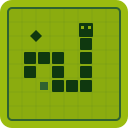
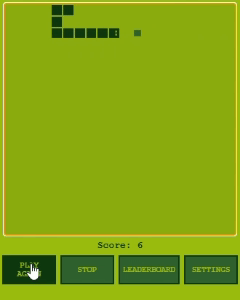

  

<h1 align="center">Snake</h1>

  <strong>The classic Nokia 3310 Snake game, right inside your VS Code sidebar.</strong>

  
  
  

**Snake** is the perfect pastime for when you're vibecoding and waiting for the LLM to finish writing the code for you. Play directly in the VS Code Explorer panel while pretending to be productive - complete with the classic Nokia 3310 green monochrome look, pixelated graphics, and that satisfying feeling of chasing the high score (because someone else is writing the code anyway).

  

## Features

- **Classic Snake gameplay** - wrap-around movement with no walls, just like the original
- **Authentic Nokia 3310 aesthetic** - green monochrome palette, pixelated canvas, and snake eyes that follow the direction of movement
- **Special bonus food** - glowing diamond that spawns randomly, worth 5× points, but disappears quickly
- **Progressive difficulty** - the snake speeds up as it grows, with 10 configurable speed levels
- **Persistent leaderboard** - your top 10 scores are saved across VS Code sessions
- **11 languages** - auto-detects your VS Code language, with manual override in settings
- **In-editor settings** - adjust speed, toggle grid lines, and switch language without leaving the game
- **Auto-pause** - the game pauses automatically when you switch tabs or lose focus

## Getting Started

1. Install the extension from the [VS Code Marketplace](https://marketplace.visualstudio.com/items?itemName=Strifelab.snake)
2. Open the **Explorer** panel in the sidebar
3. Find the **Snake** view at the bottom of the panel
4. Hit **Start Game** and enjoy!

> **Tip:** Use the ⚙️ button to customize speed, grid, and language before playing.

## Controls

| Key             | Action                       |
| --------------- | ---------------------------- |
| `↑` `↓` `←` `→` | Move the snake               |
| `W` `A` `S` `D` | Move the snake (alternative) |

## Settings

Access settings through the ⚙️ button in the game panel:

| Setting      | Description                        |
| ------------ | ---------------------------------- |
| **Language** | Choose from 11 supported languages |
| **Speed**    | Set the base speed level (1–10)    |
| **Grid**     | Toggle grid border visibility      |

## Supported Languages

- 🇬🇧 English
- 🇫🇷 Français
- 🇪🇸 Español
- 🇮🇹 Italiano
- 🇩🇪 Deutsch
- 🇧🇷 Português
- 🇨🇳 中文
- 🇯🇵 日本語
- 🇰🇷 한국어
- 🇷🇺 Русский
- 🇮🇳 हिन्दी

## Feedback & Issues

Found a bug? Have a feature request? [Open an issue on GitHub](https://github.com/Strifelab/Vscode-Snake/issues).

Want to contribute? Check out the [Contributing Guide](CONTRIBUTING.md).

## License

[MIT](LICENSE) © [Strifelab](https://github.com/Strifelab)
